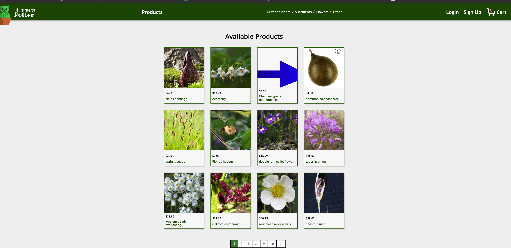

# Grace-Potter

​Grace-Potter is an e-commerce site for indoor and outdoor plants. Users can add to cart, and checkout, both as guests or as a logged-in user.

# Check out our store:

http://grace-potter.herokuapp.com/

OR

npm start

# Gallery

## Built With

Tech Stacks

- React
- Redux
- Node Express.JS
- Sequelize
- PostgresQL

API

- Trefle

## Authors

- [**Shay Lewis**](https://github.com/shaylew/)
- [**Renata Bubic**](https://github.com/renatabubic)
- [**Sooin Chung**](https://github.com/sooinc)
- [**Eunjoon Hwang**](https://github.com/joonybejoy)

## License

This project is licensed under the MIT License - see the [LICENSE.md](LICENSE.md) file for details
